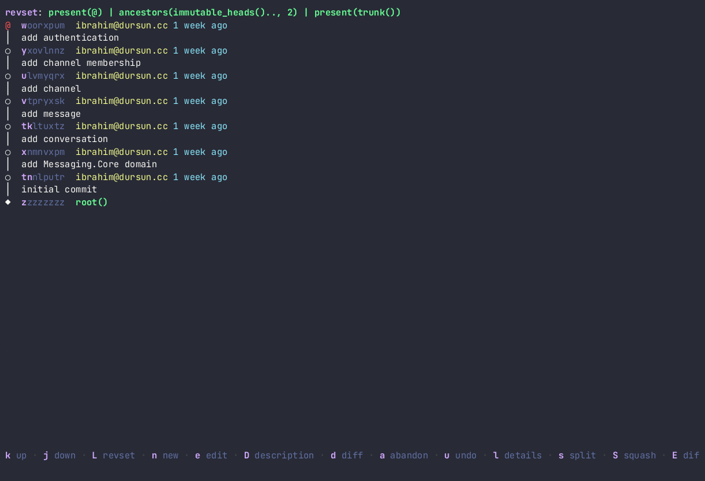
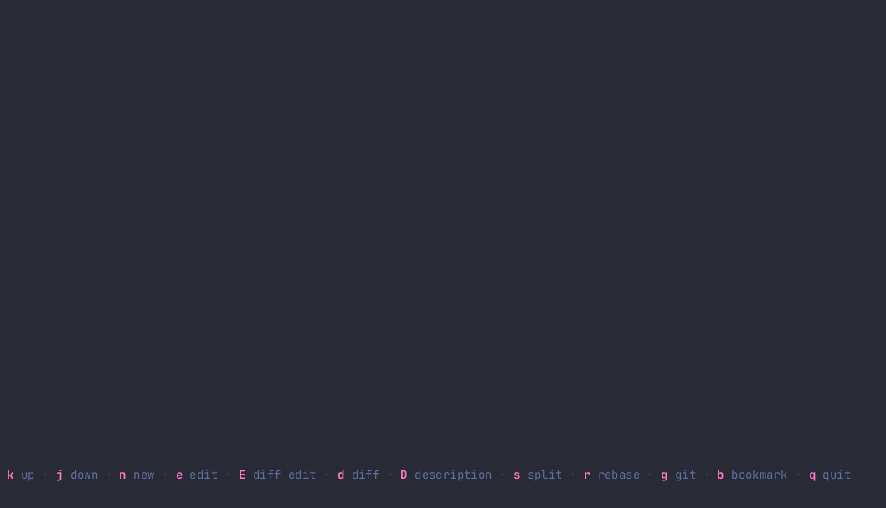

[](https://github.com/idursun/jjui/actions/workflows/go.yml)

# Jujutsu UI

`jjui` is a terminal user interface for working with [Jujutsu version control system](https://github.com/martinvonz/jj). I have built it according to my own needs and will keep adding new features as I need them. I am open to feature requests and contributions.

## Features

Currently, you can:

### Change revset with auto-complete
You can change revset while enjoying auto-complete and signature help while typing.


### Rebase
You can rebase a revision or a branch onto another revision in the revision tree.


### Squash
You can squash revisions into one revision, by pressing `S`. The following revision will be automatically selected. However, you can change the selection by using `j` and `k`.


### Show revision details

Pressing `l` (as in going right into details of a revision) will open the details view of the revision you selected.

You can use `d` to show the diff of the each highlighted file.


#### Splitting files in a revision
You can use `s` to split the revision based on the files you have selected. You can select by pressing `space`. If no file is selected, currently highlighted file will be split.



### Restoring files in a revision
You can use `r` to restore the selected file (i.e. discard the changes).


### Description
You can edit or update description of a revision.


### Abandon
You can abandon a revision.


### Bookmarks
You can move bookmarks to the revision you selected.


### Diffs
You can see diffs of revisions.


### Split
You can split revisions.


Additionally,

* Create a _new_ revision
* _Edit_ a revision
* Git _push_/_fetch_
* Undo last change

## Installation

### Nix

You can install `jjui` using nix from the unstable channel.

```shell
nix-env -iA nixpkgs.jjui
```

### From source

You can build `jjui` from source.

```
git clone https://github.com/idursun/jjui.git
cd jjui
go install cmd/jjui.go
```

### From pre-built binaries
You can download pre-built binaries from the [releases](https://github.com/idursun/jjui/releases) page.

## Compatibility

It's compatible with jj **v0.21**+.

## Contributing

Feel free to submit a pull request.
